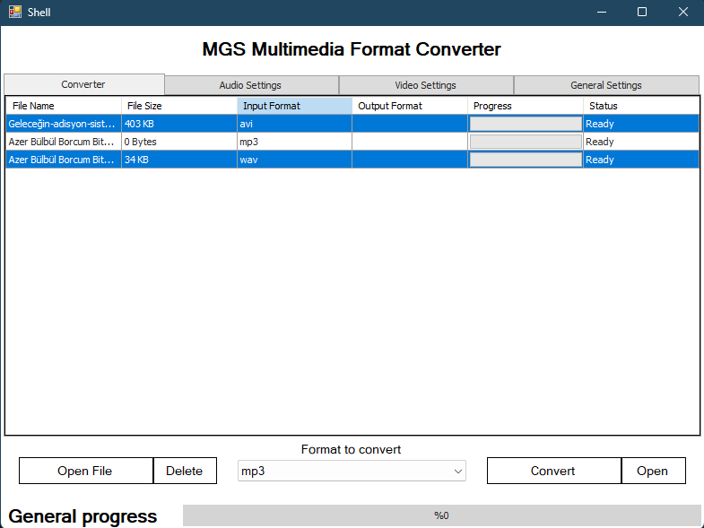

# Multimedia-Format-Converter

## About

This project is a multimedia format converter developed using WinForms. It allows users to convert various multimedia files (such as audio and video) from one format to another with a user-friendly interface.

## Screenshot


## Features

- **Format Conversion**: Convert multimedia files between different formats (e.g., MP4, AVI, MP3, WAV).
- **Batch Processing**: Supports conversion of multiple files at once.
- **User-Friendly Interface**: Easy-to-use WinForms interface for managing conversions.
- **Progress Tracking**: Monitor the progress of ongoing conversions.

## Technologies Used

- **C# WinForms**: Framework for building the desktop application interface.
- **.NET Framework/Core**: Backend logic and operations.
- **Third-Party Libraries**: Utilizes libraries for multimedia format handling and conversion.
- **Visual Studio**: Integrated development environment used for development.

## Installation

1. **Clone the Repository**:
    ```sh
    git clone https://github.com/BeratARPA/Multimedia-Format-Converter.git
    ```
2. **Open with Visual Studio**: Open the project in Visual Studio.
3. **Install Dependencies**: Restore any necessary dependencies.
4. **Build the Project**: Build the solution to ensure proper setup.
5. **Run the Project**: Press F5 to run the project and access the converter interface.

## Usage

1. **Launch the Application**: Start the application from Visual Studio or the executable.
2. **Select Files**: Choose the multimedia files you want to convert.
3. **Choose Output Format**: Select the desired output format for conversion.
4. **Start Conversion**: Initiate the conversion process and monitor progress.
5. **View Results**: Check the output directory for converted files.

## Contributing

If you would like to contribute, please fork the repository, create a feature branch, and submit a pull request.

## License

This project is licensed under the MIT License. See the [LICENSE](LICENSE) file for more details.

## Contact

For questions or feedback, feel free to contact me:
- **Email**: [beratarpa@hotmail.com](mailto:beratarpa@hotmail.com)
- **GitHub**: [https://github.com/BeratARPA](https://github.com/BeratARPA)
